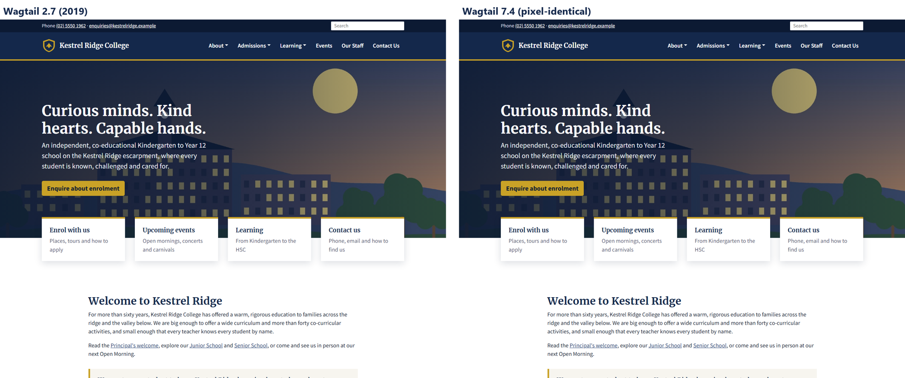
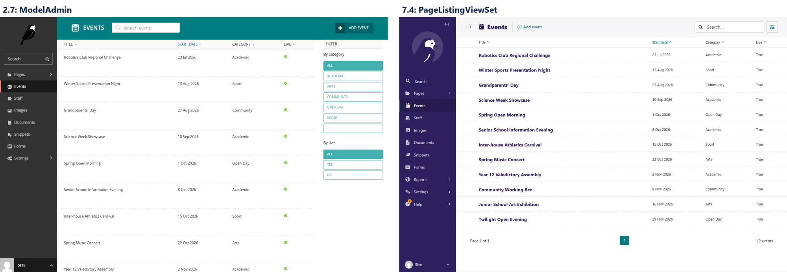
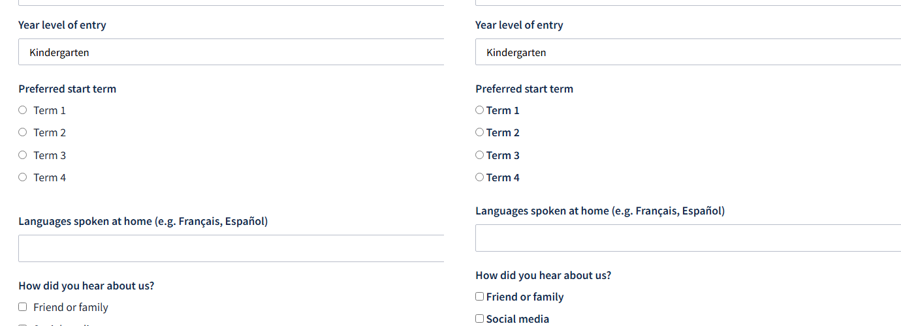
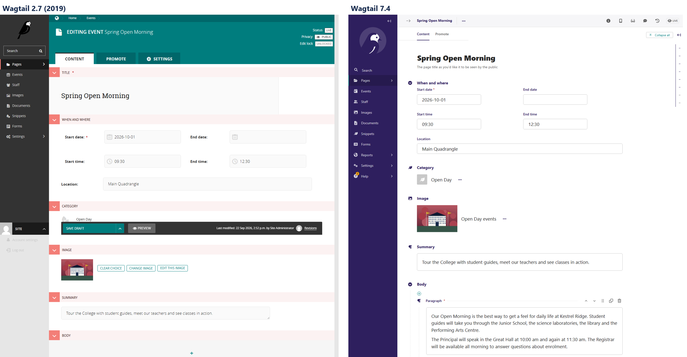

# I Upgraded Wagtail 2.7 → 7.4 — Everything That Broke

Most Wagtail upgrade posts cover one feature release. This one covers seven years.

I built a school website on **Wagtail 2.7 and Django 2.2**, written exactly the way a 2019 project was written, filled it with realistic content, and then upgraded it to **Wagtail 7.4 LTS on Django 5.2**. I logged every command, captured every error before fixing it, and checked the result against the original byte for byte and pixel for pixel.

The code, the logs and every screenshot are public: **[github.com/apequaltowork/wagtail-school](https://github.com/apequaltowork/wagtail-school)**. The history is one commit per step, so you can follow the whole upgrade in order, or jump straight to a stage with the tags `v2.7-baseline`, `v2.15` and `v7.4`.

**Summary:** 22 things broke. Most were loud ImportErrors that take a minute each to fix. Four were silent, and those are the ones this post is really about:

- **The 2.10 form-builder change** made every enquiry form lose its data, and running Django's system checks was the only thing that could bring it back.
- **StreamField columns stayed `text`** after the jump. Pages worked, and JSON queries failed.
- **Logged search queries were deleted by `migrate`**, because the migration meant to copy them has been a no-op since Wagtail 6.0.
- **Static-file hashing silently switched off** because Django 5.1 ignores the old setting.

---

## The site: Kestrel Ridge College (fictional)

A realistic independent K–12 school site, so the upgrade meets the kind of code real projects have:

- A home page with hero, quick links and upcoming events, plus 11 standard pages built from a **StreamField** with headings, rich text, images, quotes, calls to action, documents and **TableBlock**.
- **Events** (a `RoutablePageMixin` index with a `/past/` route and a category filter) and **Staff** (grouped by department), both with snippets.
- Two form-builder pages, **Enrolment Enquiry** and **Contact**, with **40 real submissions**. The enquiry form's labels deliberately include apostrophes, a slash, a question mark and accented characters: *"Parent/Guardian's full name"*, *"Languages spoken at home (e.g. Français, Español)"*. Keep an eye on those.
- `wagtail.contrib.modeladmin` for the Events and Staff menus, `BaseSetting` for the school's contact details, `SiteMiddleware` and `request.site`, `url()` routes and `ugettext_lazy`: everything a 2019 project used.



## How I proved nothing was lost

Before touching anything, I recorded a **baseline** from the running 2.7 site:

- every live URL and its HTTP status (55 URLs)
- the normalised visible text of every page (51 pages): the proof that StreamField content survives
- counts: pages per type, images, documents, snippets, submissions per form
- **each form's submissions, exported with Wagtail's own admin CSV export**
- for every form field, the key its data is stored under
- full-page screenshots of 13 front-end pages and 16 admin screens
- a `pg_dump` and a zip of `media/`

Every stage got its own folder, virtualenv and database, restored from the previous stage's dump, and was checked against the same baseline.

## The route: 2.7 → 2.15 LTS → 7.4 LTS

Wagtail recommends upgrading one feature release at a time. I didn't: I did two hops.

**Why stop at 2.15:** it's the LTS release that contains the 2.10 form-builder change, and it's one of the few releases (2.10–2.16) that can still repair old form data (you'll see why). Wagtail 3.0's release notes say so directly: projects older than 2.10 must pass through 2.10–2.16 before 3.0.

**Why jump from 2.15 straight to 7.4:** because that's how I actually upgrade client sites, and I wanted to know what it costs. The answer is two pieces of silent damage, covered below.

---

# Hop 1: 2.7 → 2.15

Django 2.2 → 3.2, Python 3.8 → 3.10. Six breakages.

### B01 — The first wall is the database driver

```
error: Microsoft Visual C++ 14.0 or greater is required.
ERROR: Failed building wheel for psycopg2-binary
```

Wagtail 2.15 is the first release to support Python 3.10, and psycopg2-binary 2.8 has no Python 3.10 wheels, so pip tries to compile it from source. The fix is `psycopg2-binary>=2.9,<2.10`. The old line stays in `requirements.txt`, commented out with the reason.

### B02 — `models.W042` × 6

Django 3.2's "Auto-created primary key" warning. One line, `DEFAULT_AUTO_FIELD = 'django.db.models.AutoField'`, keeps the existing integer IDs with no migrations.

### B03 — "System check identified no issues", then every page crashes

```
ModuleNotFoundError: No module named 'wagtail.core.middleware'
```

`manage.py check` is green, because middleware only loads on the first request. `SiteMiddleware` and `request.site` were deprecated in 2.9 and moved in 2.11. I replaced them with `Site.find_for_request(request)` in the menu tag. (The smaller alternative is the legacy middleware path.)

### B04 — Every enquiry form loses its data

This is the one to understand before upgrading any site that uses Wagtail's form builder.

In Wagtail 2.7, a submission's data is keyed by a name **computed from the label every time**: `slugify(unidecode(label))`. So *"Parent/Guardian's full name"* is stored as `parentguardians-full-name`.

Wagtail 2.10 made that key a **stored database field**, `clean_name`, generated a different way (`parentguardians_full_name`, underscores). `makemigrations` adds it like this:

```python
migrations.AddField(model_name='formfield', name='clean_name',
    field=models.CharField(blank=True, default='', ...))
```

No data migration. After `migrate`, **all 14 form fields had an empty `clean_name`**. Here's what a production server, which never runs Django's system checks, then served:

- the 10-field enrolment form rendered as **a single field named `""`**
- the admin submissions list showed **none** of the stored values
- the CSV export had ten columns, **all headed "Subscribe to our newsletter"**, with every value `None`

```
Submission date,Subscribe to our newsletter,Subscribe to our newsletter,Subscribe to our newsletter,…
2026-03-27 21:06:16.451089+00:00,None,None,None,None,None,None,None,None,None,None
```

The data was still in the database. Nothing could read it.

Wagtail does repair this, but inside a **system check**, not a migration. `AbstractFormField.check()` fills blank `clean_name`s with the legacy hyphenated key. So I ran `manage.py check`:

```
Exception: You have form submission data that was created on an older version of Wagtail
and requires the unidecode library to retrieve it correctly. Please install the unidecode package.
```

Wagtail 2.7 depended on Unidecode, and 2.15 doesn't, so the repair needs a package the upgrade removed. After `pip install Unidecode` and one more `check`:

```
forms.FormField: Added `clean_name` on 10 form field(s)
forms.ContactFormField: Added `clean_name` on 4 form field(s)
```

All 14 keys matched the stored data again, and all 30 enquiries came back in the form, the admin and the CSV.

**Lessons:**
- Add `Unidecode` to your requirements before this upgrade.
- Run `manage.py check` on the server after deploying. Until something runs system checks, your live forms are broken.
- Fields added *after* the upgrade get snake_case keys, so one form can end up with two naming styles for good.

### B05 — The CSV export button that isn't

`?action=CSV` quietly returns the HTML listing on 2.15. It's `?export=csv` now (the submissions list uses `SpreadsheetExportMixin`). I couldn't find this in the release notes, and it breaks any script or bookmark that downloads exports.

### B06 — `get_document_model` moved

`wagtail.documents.models` → `wagtail.documents` (2.8). This only showed up when I seeded a fresh database, which is exactly why a fresh-database check belongs in every upgrade.

**Result of hop 1:** the crawl matched the 2.7 baseline **byte for byte**, including both CSV exports, and all 12 non-404 front-end pages were **pixel-identical**.

---

# Hop 2: 2.15 → 7.4

Django 3.2 → 5.2 LTS, Python 3.10 → 3.12. Sixteen breakages, and the install was the easy part: `pip install` of Wagtail 7.4.3 and Django 5.2.17 worked first time.

## The import wall (B07–B14)

Then `python -Wa manage.py check` failed **eight times in a row**, one missing import at a time:

| # | Error | Removed in | Fix |
|---|---|---|---|
| B07 | `No module named 'wagtail.contrib.modeladmin'` | Wagtail 6.0 | `PageListingViewSet` (below) |
| B08 | `No module named 'wagtail.core'` | 3.0 / 5.0 | `wagtail updatemodulepaths .` |
| B09 | `cannot import name 'ugettext_lazy'` | Django 4.0 | `gettext_lazy` |
| B10 | `cannot import name 'StreamFieldPanel'` | 3.0 / 5.0 | `FieldPanel` |
| B11 | `cannot import name 'BaseSetting'` | 4.0 / 5.0 | `BaseSiteSetting` |
| B12 | `cannot import name 'url' from 'django.conf.urls'` | Django 4.0 | `re_path` |
| B13 | `cannot import name 'Query' from 'wagtail.search.models'` | 5.0 / 6.0 | `wagtail.contrib.search_promotions` |
| B14 | `wagtailadmin.W003 WAGTAILADMIN_BASE_URL is not defined` | 3.0 / 5.0 | rename `BASE_URL` |

What surprised me: **none of these printed a deprecation warning on 2.15.** The `wagtail.core` → `wagtail` rename, the panel changes and ModelAdmin's removal all happened after 2.x, so a clean `-Wa` run on 2.15 tells you nothing about them.

The biggest diff of the whole upgrade was a single command. `wagtail updatemodulepaths .` rewrote 19 files, including old migrations. It doesn't replace the removed panel classes, though, and it leaves `wagtail.images.edit_handlers` alone. (Its help text still says *"Update a Wagtail project tree to use Wagtail 2.x module paths"*.)

### ModelAdmin → PageListingViewSet

Both ModelAdmins listed **Page** models (events and staff), which snippet viewsets can't register. Core Wagtail's `PageListingViewSet` is the replacement:

```python
class EventPageListingViewSet(PageListingViewSet):
    index_view_class = EventPageListingIndexView   # default_ordering = 'start_date'
    model = EventPage
    menu_label = 'Events'
    icon = 'date'
    add_to_admin_menu = True
    list_display = ['title', 'start_date', 'category', 'live']
    list_filter = ['category', 'live']
```

Watch out: the listing comes out in tree order until you set `default_ordering` on the index view, which replaces ModelAdmin's `ordering`.



## B15 — The migration that never came

After the import fixes, `makemigrations` produced **no StreamField changes**, and `migrate` ran 64 migrations cleanly. Pages returned 200. Then:

```python
EventPage.objects.filter(body__contains=[{'type': 'call_to_action'}])
```
```
ProgrammingError: operator does not exist: text @> jsonb
```

Wagtail 3.0 moved StreamField storage from text to JSON: you added `use_json_field=True`, and `makemigrations` generated an `AlterField` that converted the column. Wagtail 5.0 made it mandatory. **From 6.0, `use_json_field` is ignored and no longer appears in migrations**, so Django sees no difference between a 2019 migration and a 7.4 model. If you skip 3.0–5.x, that conversion migration **is never generated**.

Wagtail's own tables were converted (revisions, log entries, `form_data` are all `jsonb`). My three `body` columns stayed `text`. A fresh 7.4 database gets `jsonb`, this upgraded one kept `text`, and no tool reported the difference.

The fix is a hand-written migration per app:

```python
migrations.RunSQL(
    sql='ALTER TABLE events_eventpage ALTER COLUMN body TYPE jsonb USING body::jsonb',
    reverse_sql='ALTER TABLE events_eventpage ALTER COLUMN body TYPE text USING body::text',
)
```

It's a no-op on fresh databases and leaves model state unchanged. Afterwards the query returns the two Open Day events that have a call to action.

## B16 — Data lost by design

The restored database held two logged search queries. After `migrate`:

```
after migrate: queries = 0 , daily hits = 0
```

The migration log shows why. `wagtailsearch.0008_remove_query_and_querydailyhits_models` dropped the old tables, and `wagtailsearchpromotions.0004_copy_queries` ran "OK" without copying anything. Here's its source:

```python
# Changed to a no-op in Wagtail 6.0.
# ... any project that needs this data migration would have already applied
# the real version of this migration while they were running Wagtail 5.
operations = []
```

Skip Wagtail 5 and this data is gone. I recovered it from the pre-upgrade dump (`pg_restore --data-only -t wagtailsearch_query …`, then recreated the rows through the new models).

**This is the strongest argument I found for upgrading one LTS at a time.** If you jump anyway: take the dump before `migrate`, and check every table you care about afterwards.

## B19 — Static-file hashing silently switched off

The 2019 settings still said:

```python
STATICFILES_STORAGE = 'django.contrib.staticfiles.storage.ManifestStaticFilesStorage'
```

Django 5.1 removed that setting in favour of `STORAGES`, and **Django ignores settings it doesn't know**. There's no error and no warning: production just stops getting hashed filenames, and browsers keep serving old CSS after each deploy. The 2.7 project template's own comment warns about stale assets *"after a Wagtail upgrade"*. Moving it to `STORAGES` fixed it.

## B21 — Bold radio buttons

The only visible break on the front end, and pixel diffing found it:



Django 4.0 changed `RadioSelect` and `CheckboxSelectMultiple` from `<ul><li>` to `<div><div>`. The 2019 CSS targeted `fieldset ul label`, so it stopped matching. I retargeted it at `fieldset > div …` and restored the 1rem margin the `<ul>` used to give, and the form was back to **zero pixels different**.

## B22 — `w-block-*`

Wagtail 7.4 renders StreamField blocks as:

```html
<div class="w-block-heading block-heading">
```

The old `block-heading` class stays for now but *"will be removed in a future release"*. I moved all 15 selectors to `.w-block-…`, and the pages are still pixel-identical.

## The rest

- **B17** — `FormSubmission.form_data` is a JSONField since 3.0. Code that `json.loads()` it gets a dict and crashes (here, my baseline tool). Reports and CRM syncs break the same way.
- **B18** — Search got *better*: the 2.15-era `db` backend matched titles only, and 7.4's `database` backend indexes content, so "music" finds 7 results instead of 1. It's the only text difference across all 51 pages. I accepted it as the expected new behaviour.
- **B20** — My own seed command imports `unidecode`. It had always come in with Wagtail, so I dropped it from requirements, wrongly. Declare what you import.
- Also run **`update_index`** (new search backend) and **`rebuild_references_index`** (4.1) after upgrading.

---

## The result

| Check | 2.7 → 7.4 |
|---|---|
| URL statuses (55) | identical |
| Page text (51 pages) | **49 identical**; 2 search pages return more results (B18) |
| Counts (pages, images, documents, snippets, submissions) | identical |
| Form CSV exports (30 + 10 submissions) | **byte-for-byte identical** |
| Front-end screenshots (13) | **11 pixel-identical**; search (B18) and Django's debug 404 differ |
| `python -Wa manage.py check` | **0 warnings** |
| `makemigrations --check` | no changes |
| Fresh database migrate + seed | same counts as 2019 |



## If you're about to do this: a checklist

1. **Record a baseline first.** URLs, page text, counts, form exports, screenshots and a DB dump. Without it, "it looks fine" is all you have.
2. **Stop at 2.15 (or any 2.10–2.16) if you use the form builder.** Add `Unidecode`, deploy, and **run `manage.py check`** so the `clean_name` backfill happens.
3. **Pass through Wagtail 5.x if you can.** It generates the StreamField JSON migration and copies the search query log. If you jump, check column types (`body` should be `jsonb`) and write the conversion yourself.
4. **Take a dump right before `migrate`.** B16 was only recoverable because of it.
5. **Grep your settings for names Django no longer reads:** `STATICFILES_STORAGE`, `DEFAULT_FILE_STORAGE`, `USE_L10N`, `BASE_URL`.
6. **Run `wagtail updatemodulepaths`**, then fix what it doesn't cover: panels, `edit_handlers`, `BaseSetting`, ModelAdmin.
7. **Pixel-diff your front end.** The only visual break (Django's widget markup) wasn't in any Wagtail release note.
8. **Seed or migrate a fresh database too.** It finds the imports your live site never touches.
9. **After deploying:** `update_index`, `rebuild_references_index`, `check`.

## Every breakage

| ID | Hop | Symptom | Cause | Impact |
|---|---|---|---|---|
| B01 | 2.15 | psycopg2 needs a C compiler | no Python 3.10 wheel for 2.8 | Medium |
| B02 | 2.15 | `models.W042` × 6 | Django 3.2 `DEFAULT_AUTO_FIELD` | Low |
| B03 | 2.15 | check green, every page 500s | SiteMiddleware moved (2.9/2.11) | High |
| B04 | 2.15 | forms collapse, submissions unreadable | 2.10 `clean_name`; backfill needs unidecode | **High** |
| B05 | 2.15 | `?action=CSV` returns HTML | SpreadsheetExportMixin (`?export=csv`) | Medium |
| B06 | 2.15 | `get_document_model` ImportError | moved in 2.8 | Low |
| B07 | 7.4 | no `wagtail.contrib.modeladmin` | removed in 6.0 | High |
| B08 | 7.4 | no `wagtail.core` | 3.0 rename | High |
| B09 | 7.4 | no `ugettext_lazy` | Django 4.0 | Low |
| B10 | 7.4 | no `StreamFieldPanel` | 3.0 → FieldPanel | Medium |
| B11 | 7.4 | no `BaseSetting` | 4.0 → BaseSiteSetting | Low |
| B12 | 7.4 | no `url()` | Django 4.0 | Low |
| B13 | 7.4 | no `wagtail.search.models.Query` | moved to search_promotions | Medium |
| B14 | 7.4 | `W003` base URL | `BASE_URL` renamed (3.0) | Low |
| B15 | 7.4 | StreamField columns still `text` | 3.0–5.x JSON migration never generated | **High** |
| B16 | 7.4 | search query log deleted | copy migration a no-op since 6.0 | **High** |
| B17 | 7.4 | `json.loads(form_data)` crashes | form_data is a JSONField (3.0) | Medium |
| B18 | 7.4 | more search results | `database` backend | Medium |
| B19 | 7.4 | no hashed static files | `STATICFILES_STORAGE` removed (Django 5.1) | High |
| B20 | 7.4 | seed: no `unidecode` | undeclared transitive dependency | Medium |
| B21 | 7.4 | bold radio/checkbox options | Django 4.0 widget markup | High |
| B22 | 7.4 | `block-*` classes going away | 7.4 `w-block-*` | Medium |

Full details for each (the exact error, the log file, the fix commit, and the versioned docs link) are in [`notes/UPGRADE_LOG.md`](../notes/UPGRADE_LOG.md). The reasoning behind each choice is in [`notes/DECISIONS.md`](../notes/DECISIONS.md).

---

*Kestrel Ridge College is fictional: every person, phone number and image in the demo was made up for this project.*
